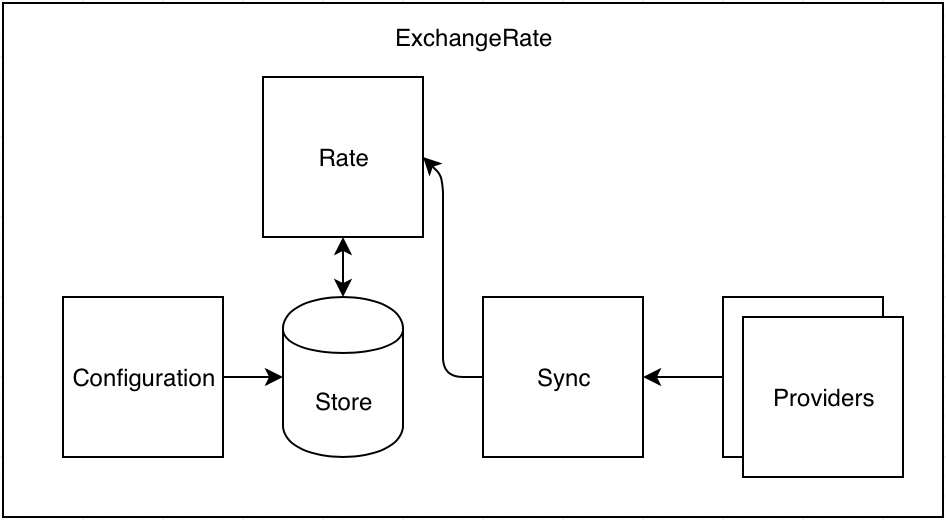

# Exchange Rate
## Overview
A library for retrieving, storing and providing exchange rates for the purpose of currency conversion.

## Getting started
The library isn't hosted on Rubygems or a private repository, so the simplest way to include this in a project is via the `path` option in your `Gemfile`:

```ruby
# Gemfile
gem "exchange-rate", path: "/path/to/gem"
```

The library depends on Redis to store rates. You can configure the library to use a specific Redis instance:

```ruby
# initializer.rb
# configure values in .env
ExchangeRate.configure do |config|
  config.redis_host = ENV.fetch("ER_REDIS_HOST")
  config.redis_port = ENV.fetch("ER_REDIS_PORT")
  config.redis_db = ENV.fetch("ER_REDIS_DB")
end
```

From there, the library has two public interfaces: fetching and persisting exchange rates, and calculating exchange rates. For the purposes of synchronising rate data regularly, the sync module can be called from a Ruby script via `cron`, or a background job, etc.

```ruby
# worker.rb

# Fetch all exchange rates from default provider and persist in datastore
ExchangeRate::Sync.call
# => true

# Fetch exchanges rates for specific date and persist in datastore
ExchangeRate::Sync.call(Date.today)
# => true
```

If the synchornisation fails, an exception will be passed back to the caller:

```ruby
# HTTP request failed, attempt a retry
ExchangeRate::ThirdPartyRequestError

# XML failed to parse or schema changed, unqueue
ExchangeRate::ParseError

# Failed to persist in datastore, unqueue
ExchangeRate::DataStoreError

# No rate was available for the given date, attempt retry
ExchangeRate::NoRateError
```

Calculating exchange rates is simple. The caller is responsible for adding their own precision as their UI dictates:
```ruby
# calculate.rb

ExchangeRate.at(Date.today, "USD", "GBP")
# => 0.7642234308900975
```

It is possible to look up a rate on a date where the provider does not offer one (such as a weekend). In this instance, the library will return the most recent rate.

If you attempt to fetch a rate which is earlier than the least recent, or there are no rates available, an exception will be thrown:

```ruby
ExchangeRate.at(Date.today - 10000, "USD", "GBP")
# => ExchangeRate::NoRateError
```

For the purposes of testing behaviour, a console script is provided in `bin/console`.

## Providers
In order to address the necessity to easily swap out data sources, a notion of `providers` is given. By default, a `EuroCentralBank` class is provided to handle the fetching and parsing of data from the ECB website.

Writing and registering your own is simple. A `provider` needs to implement a `#rates` method which optionally takes a `Date` argument. This method returns a collection of hashes representing the rates to be persisted.

```ruby
class MyExampleProvider
  def rates(date)
    nodes.map do |node|
      {
        date: node[:date],
        currency: node[:currency],
        rate: node[:rate]
      }
    end
  end

  private

  # some business logic
end

```

Registering and setting the provider is straightforward:

```ruby
ExchangeRate.configure do |config|
  config.register_provider(:example, MyExampleProvider)
  config.provider = :example
end
```

## Testing
A test suite to cover the most important behaviours and edge-cases in the codebase can be run with `rspec`.

```
..................................

Finished in 0.17832 seconds (files took 1.07 seconds to load)
34 examples, 0 failures
```

### Edge cases
A few "gotchas" were identified during development, and have relevant test cases to cover them:

- If a caller attempts to retrieve a future rate which does not yet exist–such as today's rates before 16:00 CET, or during the weekend–the library should return the most recent rate instead.
- If a caller attempts to retrieve a rate which is earlier than the least recent date known to the library, an exception should be raised which can be handled by the caller.

## Design
The library is designed to follow the single responsibility principle, and as such has concerns which represent the different areas of behaviour.



### Redis
The library, in its current state, uses Redis as its datastore. Since there is no relationality to the data presently, Redis is a reasonable candidate for its speed and versatility. In the future, to expand capabilities of the library, it may be desirable to use a SQL datastore instead when time is not at a premium.

### Is this production ready?
Absolutely not! There are lots of areas that deserve further consideration before putting a library like this into production. This effort attempts to do is pay service to best practice, but is cognizant of the drawbacks:

- More robust error handling for fetching and parsing of third-party documnets
- More thoroughly-applied type checking for data ingress into the library
- Further test coverage around edge-cases
- Consider future datastore solutions
